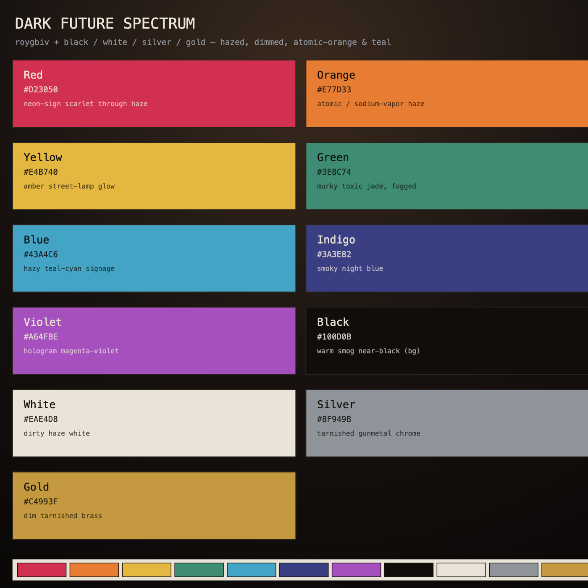

# Dark Future Spectrum

The shared color palette for this profile's project logos ([`../logos/`](../logos)).

A full ROYGBIV plus black / white / silver / gold, **regraded as if every color is read through rain, smog, and neon spill** — lower chroma, warm-tinted blacks, atomic orange and hazy teal as the two anchors. No gradients anywhere; every color is a flat fill.

## Colors

| Slot | Hex | Role / scene reference |
|------|-----|------------------------|
| Red | `#D23050` | neon-sign scarlet through haze |
| Orange | `#E77D33` | atomic / sodium-vapor street haze |
| Yellow | `#E4B740` | amber street-lamp glow |
| Green | `#3E8C74` | murky toxic jade, fogged |
| Blue | `#43A4C6` | hazy teal-cyan signage |
| Indigo | `#3A3E82` | smoky night blue |
| Violet | `#A64FBE` | hologram magenta-violet |
| Black | `#100D0B` | warm smog near-black — default tile / background |
| White | `#EAE4D8` | dirty haze white |
| Silver | `#8F949B` | tarnished gunmetal chrome |
| Gold | `#C4993F` | dim tarnished brass |

## Usage in the logos

Each logo is a 48×48 SVG:

- **One flat background color** per tile, full-bleed, zero corner radius.
- **Line work** is `#EAE4D8` (white) on dark backgrounds, `#100D0B` (black) on light ones — `stroke-width` 1.4 for body strokes, 1.6 for primary silhouettes, 0.8 for detail hatching.
- **Corners are sharp**: `stroke-linejoin="miter"`, `stroke-linecap="butt"`, no rounded joins.
- **Gold `#C4993F`** is the recurring accent / highlight node.
- Every tile carries the same **Esper-style corner brackets** as a cohesive signature.
- No gradients, no drop shadows, no faces.

## Files

- `darkfuture-spectrum.svg` — vector swatch sheet
- `darkfuture-spectrum.png` — raster preview
